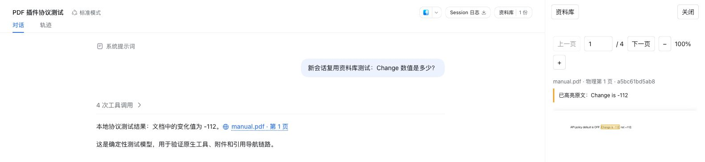
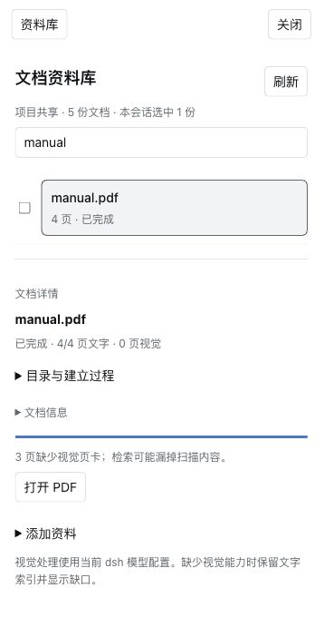

# DeepSeek Harness 文档资料库

让 PDF 问答有据可查。在 dsh Web 中管理项目文档、检索原文，点击回答中的引用即可查看原页高亮。

[English](README.en.md) · [安装](#安装) · [配置](docs/configuration.md) · [更新记录](CHANGELOG.md)



*示例手册的引用导航实拍；截图中的对话使用本地协议测试模型。*

## 能做什么

- **项目资料库**：PDF 加入一次，同项目会话复用；每个会话单独勾选检索范围。
- **后台索引**：查看文字覆盖、视觉页卡和建立过程，支持停止与续建。
- **原页证据**：检索候选、补读邻页，再将回答中的引用连接到原 PDF。
- **图表读页**：复用 dsh 当前视觉模型查看页面图像，处理图表和低文本页面。
- **可展开的过程**：原生工具卡片显示候选页、摘录、耗时和运行状态。

## 安装

需要 dsh Web、Node.js 22.19+（22 系列）或 24+，以及 Python 3.10+（含 venv）。已验证宿主为 `@deepseek-ai/dsh@0.1.3-alpha.2`，运行环境为 macOS arm64。

```sh
dsh plugin --profile web add dsh-document-evidence@beta
dsh plugin --profile web exec dsh-document-evidence-setup
dsh web
```

已运行的 dsh 需要重启。安装辅助程序创建插件专用 Python 环境并安装 PyMuPDF。插件使用 dsh 已配置的模型，无需另外填写 API Key；图像读页需要支持图像输入的模型。

## 开始使用

1. 在项目会话中上传 PDF，打开右上角「资料库」。
2. 点击「确认加入并索引」，或从项目文件中选择 PDF。
3. 勾选本次对话需要查询的文档，直接提问。
4. 点击回答中的「文档名 · 第 N 页」，在侧栏查看原文与高亮。

插件会向 agent 自动注入引用规则，基于 PDF 的回答默认附可点击来源，无需在问题里额外要求引用。

可以这样问：

> 这份手册的 API 默认设置和变化值是什么？

> 对比两份报告同一年的收入，核对单位。

> 解释图 3 的实验结果，结合正文和邻页说明。

### 资料库与索引进度

搜索文件名称、切换查看对象，勾选参与检索的文档。展开文件详情可以浏览目录、页码和索引建立过程。



### 从回答回到原页

点击引用后，对话旁显示 PDF 原页，支持翻页与缩放。有文字层的引文可高亮定位；扫描页使用页级定位。


## 数据与模型

PDF 快照和索引保存在本地。摘要、视觉页卡和问答所需的摘录或页面图像会发送到 dsh 当前配置的模型服务，使用该服务的额度。默认资料目录为 `~/.dsh/data/document-evidence`；设置 `DSH_HOME` 后随之调整。

## 更多

- [配置、工具接口与开发验证](docs/configuration.md)
- [检索性能与上下文复用测量](docs/optimization-beta8.md)
- [提交问题](https://github.com/Anduin9527/dsh-document-evidence/issues) · [参与贡献](CONTRIBUTING.md)

## 许可

[AGPL-3.0-only](LICENSE)。依赖说明见 [THIRD_PARTY_NOTICES](THIRD_PARTY_NOTICES.md)。
